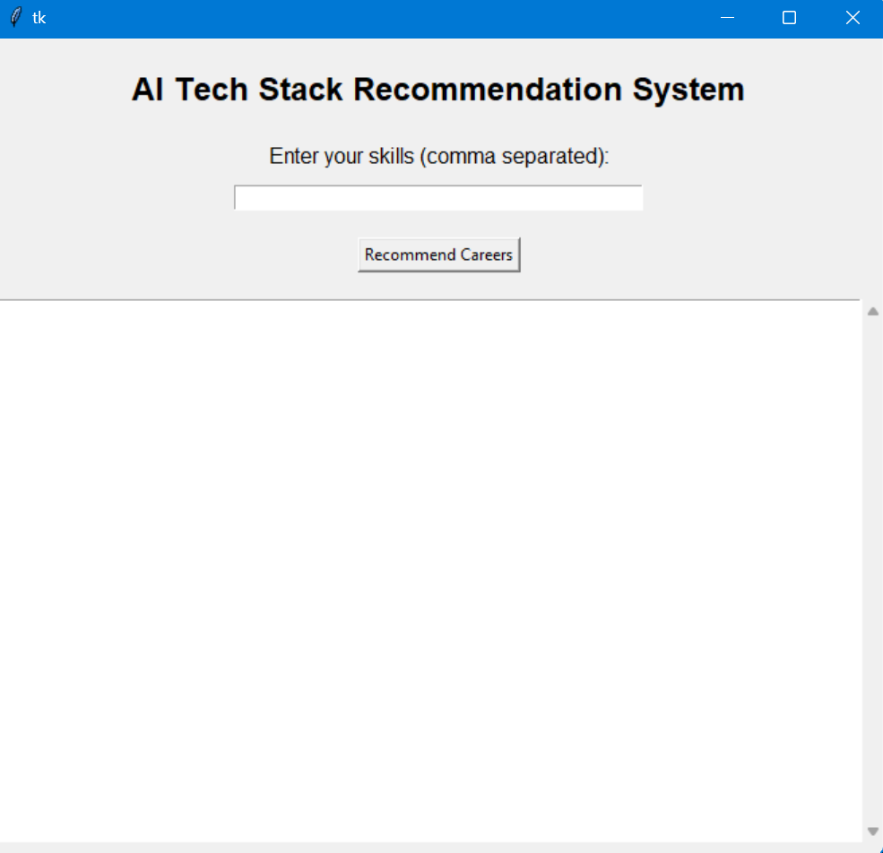
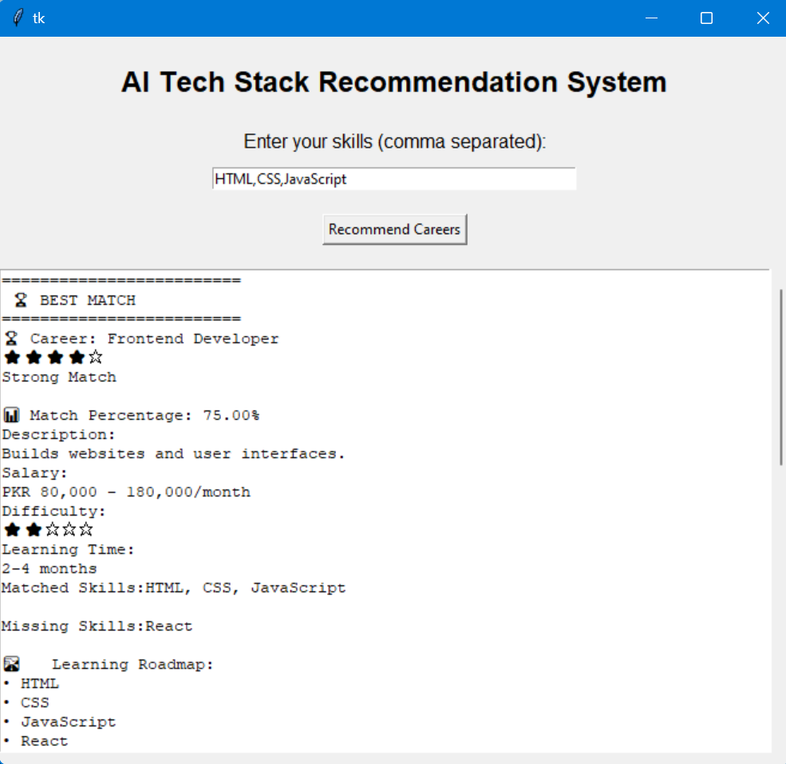

Yes, no problem. Here is the **complete ready-to-copy `README.md`**. You do **not** need to write anything yourself—just copy everything below and replace your current README.

````markdown
# 🤖 AI Tech Stack Recommendation System

A Python-based career recommendation application that analyzes a user's existing technical skills and recommends suitable software engineering career paths.

The system compares the user's skills against predefined career requirements, calculates match percentages, ranks career options, and provides personalized information about the skills the user already has and the skills they should learn next.

The project started as a command-line recommendation system and was later enhanced with a graphical user interface using Tkinter.

---

## 📌 Project Overview

Choosing a suitable technology career path can be difficult, especially when a person has several technical skills but is unsure which career best matches their current knowledge.

This project addresses this problem by:

1. Accepting the user's technical skills.
2. Comparing them with the required skills for different career paths.
3. Calculating a compatibility percentage.
4. Ranking careers from the strongest match to the weakest.
5. Displaying missing skills that the user can learn.
6. Providing career information and a learning roadmap.

The recommendation logic is based on a rule-based scoring system.

---

## ✨ Features

- Accepts multiple technical skills as comma-separated input.
- Case-insensitive skill matching.
- Matches user skills with multiple career paths.
- Calculates a match percentage for each career.
- Ranks recommendations from highest to lowest match.
- Hides careers with a 0% skill match.
- Displays match ratings using stars.
- Displays career descriptions.
- Displays estimated salary ranges.
- Displays difficulty levels.
- Displays estimated learning time.
- Shows the skills the user already has.
- Shows the skills the user should learn.
- Provides a learning roadmap for each career.
- Provides a graphical desktop interface using Tkinter.
- Includes a scrollable results area for viewing multiple recommendations.
- Handles cases where no career matches are found.

---

## 🖥️ Application Screenshots

### Main Application Window



### Career Recommendations



---

## 💻 Technologies Used

- Python 3
- Tkinter
- Dictionaries
- Nested Dictionaries
- Lists
- Loops
- Nested Loops
- Functions
- Conditional Statements
- String Manipulation
- Sorting using `sorted()`
- Lambda Functions
- Input Validation

---

## 📂 Career Paths Included

The current version includes the following career paths:

- Data Scientist
- Frontend Developer
- Backend Developer
- DevOps Engineer
- MERN Stack Developer

Each career contains:

- Required skills
- Career description
- Estimated salary range
- Difficulty level
- Estimated learning time
- Learning roadmap

---

## ⚙️ How It Works

### 1. User Enters Skills

The user enters technical skills separated by commas.

Example:

```text
HTML, CSS, JavaScript
````

---

### 2. Input Processing

The system splits the input into individual skills, removes unnecessary spaces, and converts skills to lowercase for case-insensitive matching.

For example:

```text
HTML, CSS, JavaScript
```

becomes:

```text
["html", "css", "javascript"]
```

---

### 3. Skill Comparison

The user's skills are compared against the required skills for every career.

For example:

```text
Frontend Developer

Required Skills:
HTML, CSS, JavaScript, React

User Skills:
HTML, CSS, JavaScript
```

The result is:

```text
Matched Skills:
HTML, CSS, JavaScript

Missing Skills:
React
```

---

### 4. Match Percentage Calculation

The compatibility score is calculated using:

```text
Match Percentage =
(Matched Skills / Total Required Skills) × 100
```

For example:

```text
3 matched skills / 4 required skills × 100 = 75%
```

---

### 5. Career Ranking

The careers are sorted from the highest match percentage to the lowest.

Example:

```text
1. Frontend Developer       75%
2. MERN Stack Developer     50%
```

The highest-ranked career is displayed as:

```text
🏆 BEST MATCH
```

---

### 6. Match Rating

The system converts the match percentage into a rating:

| Match Percentage | Rating                |
| ---------------- | --------------------- |
| 90% or higher    | ⭐⭐⭐⭐⭐ Excellent Match |
| 70% - 89%        | ⭐⭐⭐⭐☆ Strong Match    |
| 50% - 69%        | ⭐⭐⭐☆☆ Good Match      |
| 30% - 49%        | ⭐⭐☆☆☆ Beginner Match  |
| Below 30%        | ⭐☆☆☆☆ Weak Match      |

---

## 🧠 Recommendation Logic

This project uses a rule-based recommendation approach.

The system does not use machine learning. Instead, it follows predefined rules:

```text
User Skills
     ↓
Compare with Career Skills
     ↓
Count Matching Skills
     ↓
Calculate Match Percentage
     ↓
Sort Careers
     ↓
Display Recommendations
```

This approach demonstrates the basic logic behind recommendation systems using Python fundamentals.

---

## 🖥️ Graphical User Interface

The command-line version was extended into a desktop application using Tkinter.

The GUI includes:

* Application title
* Skill input field
* Recommendation button
* Scrollable results area
* Career recommendation details

### GUI Structure

```text
Main Window
│
├── Application Title
├── Skills Input Field
├── Recommend Careers Button
│
└── Results Frame
    ├── Results Text Area
    └── Scrollbar
```

The GUI allows users to interact with the recommendation system without using the terminal.

---

## 📁 Project Structure

```text
AI-Tech-Stack-Recommendation-System/
│
├── main.py
├── README.md
│
└── screenshots/
    ├── main-window.png
    └── recommendations.png
```

---

## ▶️ How to Run

### 1. Clone the Repository

```bash
git clone <your-github-repository-url>
```

### 2. Navigate to the Project Folder

```bash
cd AI-Tech-Stack-Recommendation-System
```

### 3. Run the Application

```bash
python main.py
```

Tkinter is included with most standard Python installations, so no additional external libraries are required.

---

## 🧪 Example

### Input

```text
HTML, CSS, JavaScript
```

### Output

```text
🏆 BEST MATCH

🏆 Career: Frontend Developer

⭐⭐⭐⭐☆
Strong Match

📊 Match Percentage: 75.00%

Matched Skills:
HTML, CSS, JavaScript

Missing Skills:
React
```

The system may also recommend:

```text
🥈 Recommendation #2

🏆 Career: MERN Stack Developer

⭐⭐⭐☆☆
Good Match

📊 Match Percentage: 50.00%

Matched Skills:
HTML, CSS, JavaScript

Missing Skills:
React, Node.js, MongoDB
```

---

## 🧠 Concepts Learned

Through this project, I learned:

* How basic recommendation systems work.
* How to compare user input with stored data.
* How to organize structured information using nested dictionaries.
* How to calculate compatibility percentages.
* How to sort data using Python's `sorted()` function and `lambda`.
* How to create reusable functions.
* How to separate recommendation logic from output formatting.
* How to build a graphical user interface using Tkinter.
* How to use Frames to organize GUI components.
* How to connect a scrollbar to a Text widget.
* How to display dynamically generated results in a GUI.

---

## 🚀 Future Improvements

Possible future improvements include:

* Add more career paths.
* Add skill proficiency levels such as Beginner, Intermediate, and Advanced.
* Allow users to select their experience level.
* Add personalized learning resources.
* Add a more advanced recommendation algorithm.
* Use TF-IDF and cosine similarity for more flexible skill matching.
* Store career data in a CSV file or database.
* Add machine learning-based recommendations.
* Export recommendations as a PDF report.
* Improve the visual design of the GUI.
* Add skill search and autocomplete functionality.

---

## 🎯 Learning Outcomes

This project helped me understand how a recommendation system can be built step by step.

I started with basic Python concepts and developed a rule-based recommendation engine. I then expanded the project by adding career information, match ratings, learning roadmaps, and finally a graphical user interface using Tkinter.

The project demonstrates how Python fundamentals can be combined to create a practical application.

---

## 👩‍💻 Author

**Nayab Maryam**

Software Engineering Student

**DecodeLabs AI Internship — Week 3 Project**

````
